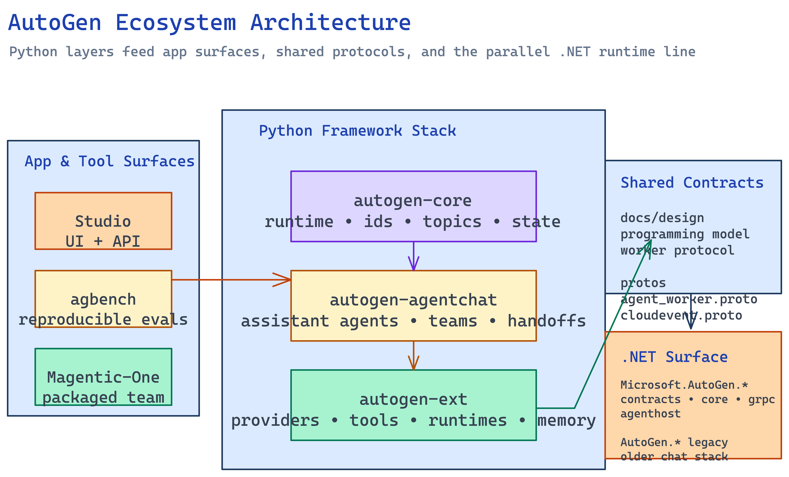

# Architecture Overview

## Overview

AutoGen is better understood as an ecosystem than as a single agent framework. The repository combines a layered Python runtime stack, application surfaces built on top of that stack, explicit protocol contracts for distributed execution, and a parallel .NET implementation that is partly legacy and partly converging on the newer event-driven runtime model. The root `README.md` makes this layering explicit: `autogen-core` owns low-level runtime and message-passing primitives, `autogen-agentchat` provides the high-level agent and team API most users start from, and `autogen-ext` supplies concrete providers, tools, runtimes, memory backends, and code executors. Around those framework layers sit delivery surfaces such as `autogen-studio`, `agbench`, and `magentic-one-cli`, plus the design docs and `.proto` contracts that define how a distributed worker/service runtime should work.

[Edit source diagram](../assets/graphs/autogen-ecosystem-architecture.excalidraw)

The resulting architecture has two distinct personalities. For many users it looks like a Python SDK stack centered on `AssistantAgent`, model clients, tools, and team orchestration. For framework authors, it looks more like an event-driven agent substrate: typed agent ids, topics, subscriptions, CloudEvents, serialization registries, and runtimes that can run in-process or across worker/service boundaries. The app surfaces then reuse those same layers in different ways. `autogen-studio` packages the framework into a FastAPI-backed prototyping UI. `agbench` packages agent systems into reproducible evaluation harnesses. `magentic-one-cli` packages a specific higher-level team composition as an executable entrypoint.

That structure is why a single flat explanation of “what AutoGen is” usually feels unsatisfying. The repository is deliberately stratified so that different user segments can stop at different heights. Beginners can stay at AgentChat. Integrators can plug providers and tools into Extensions. Runtime and systems developers can work directly with Core and the distributed worker protocol. .NET users have their own parallel package set, with the old `AutoGen.*` line still present and the newer `Microsoft.AutoGen.*` line adopting the event-driven model more directly.

## Major Subsystems

| Subsystem | Primary source area | What it owns |
|-----------|---------------------|--------------|
| Python Core Runtime | `python/packages/autogen-core/` | Agent ids, runtimes, subscriptions, message dispatch, serialization, model-context and memory primitives |
| Python AgentChat | `python/packages/autogen-agentchat/` | High-level chat agents, teams, terminations, handoffs, task runners, console UI |
| Python Extensions | `python/packages/autogen-ext/` | Model clients, MCP adapters, code executors, distributed runtime implementations, memory backends, specialized agents |
| Distributed Protocol Layer | `docs/design/`, `protos/` | Service/worker runtime model, CloudEvents envelope, agent worker RPC contracts |
| AutoGen Studio | `python/packages/autogen-studio/` | FastAPI app, UI serving, persistence, validation, gallery, lite mode, MCP bridge |
| AutoGen Bench | `python/packages/agbench/` | Reproducible benchmark execution, task initialization, Docker isolation, result aggregation |
| Magentic-One | `python/packages/magentic-one-cli/`, AgentChat/Extensions teams | Opinionated multi-agent application packaged as a CLI |
| .NET Runtime Stack | `dotnet/src/` | Legacy conversable-agent packages plus the newer event-driven `Microsoft.AutoGen.*` runtime stack |

The [Python Core Runtime](../entities/python-core-runtime.md) is the lowest shared layer in the Python stack. The exports in `autogen_core/__init__.py` show the intended surface area: `AgentRuntime`, `SingleThreadedAgentRuntime`, `AgentId`, `TopicId`, `Subscription`, `RoutedAgent`, component configuration helpers, serialization helpers, telemetry hooks, and state/memory/model-context abstractions. The low-level [`AgentRuntime`](../entities/python-core-runtime.md) protocol in `_agent_runtime.py` defines the canonical verbs of the system: send a message to one agent, publish a message to a topic, register a factory, resolve an agent id, and save or restore runtime or agent state.

[Python AgentChat](../entities/python-agentchat.md) sits one layer above that substrate. It is the user-facing API for most application builders. Instead of reasoning directly in terms of topic subscriptions and runtime-managed agent factories, AgentChat exposes named chat agents, team abstractions, handoffs, terminations, task runners, and streaming console helpers. The `AssistantAgent` implementation is the clearest indicator of the layer’s philosophy: it packages model clients, tools, workbenches, memory, structured output, and tool-iteration control behind a single high-level component, while still depending on Core model types and execution primitives underneath.

[Python Extensions](../entities/python-extensions.md) is the capability supply layer. Core and AgentChat are intentionally abstract; Extensions is where those abstractions become usable against actual providers and environments. The package tree and optional dependencies in `autogen-ext/pyproject.toml` show the breadth of that layer: OpenAI and Azure clients, Anthropic and Gemini extras, Docker and Jupyter executors, MCP tooling, gRPC runtimes, memory backends such as Chroma and Redis, task-centric memory experiments, and specialized agent/team implementations such as web surfer or Magentic-One integrations.

The [distributed runtime and worker system](../entities/distributed-runtime-and-worker-system.md) is defined partly in code and partly in design docs. `docs/design/01 - Programming Model.md` frames the system as publish-subscribe with CloudEvents as the common event envelope. `docs/design/03 - Agent Worker Protocol.md` adds the multi-process deployment story: worker processes host agent code, register the agent types they can host, and connect to service processes that coordinate placement and routing. The actual wire surface lives in [`agent_worker.proto`](../entities/protocol-contracts.md) and [`cloudevent.proto`](../entities/protocol-contracts.md), while Python `autogen-ext` and .NET `Microsoft.AutoGen.Core.Grpc` / `Microsoft.AutoGen.RuntimeGateway.Grpc` provide concrete implementations.

[AutoGen Studio](../entities/autogen-studio.md) is the most visible app surface in the repo. It is not the framework center of gravity; the README is explicit that Studio is a prototyping UI, not a production-ready app. The package combines a FastAPI backend, a frontend build, persistence and validation services, gallery support, MCP integration, and a “lite” mode that can boot a temporary UI around an in-memory or file-backed team definition. It demonstrates how the framework can be wrapped into an end-user application, but it also carries its own app-level concerns such as auth middleware, DB initialization, UI serving, and session/run management.

[AutoGen Bench](../entities/agbench.md) and [Magentic-One](../entities/magentic-one.md) represent two different downstream uses of the framework. Bench is about repeatable evaluation under controlled initial conditions. Magentic-One is about shipping a concrete agent system with a CLI surface. They are both “applications of AutoGen,” but one optimizes for measurement and comparability while the other optimizes for packaged agent behavior.

Finally, the [.NET runtime stack](../entities/dotnet-runtime-stack.md) is not merely a thin binding layer. The `dotnet/README.md` explicitly distinguishes the older `AutoGen.*` packages from the newer `Microsoft.AutoGen.*` packages that adopt the event-driven model. That makes the repository unusual: it contains both a legacy higher-level .NET line and a newer line that more closely mirrors the protocol-driven runtime concepts visible in the Python design docs and shared protobuf contracts.

## Execution Model

At the framework level, AutoGen execution starts from one of two mental models.

1. The high-level path starts with AgentChat. An application creates an `AssistantAgent` or a team, provides a model client from Extensions, optionally attaches tools, workbenches, memory, or handoff rules, and then calls `run()` or `run_stream()`. The agent stores state across calls, may iterate through tool-use loops, and emits a response or a sequence of streaming events. This is the path documented in the root README’s quickstart.

2. The low-level path starts with Core. An application creates an `AgentRuntime`, registers factories or instances, subscribes agents to topics, starts the runtime, and then sends or publishes messages. In the default `SingleThreadedAgentRuntime`, these messages are placed onto an asyncio queue, wrapped in publish/send/response envelopes, processed by runtime dispatch, and handed to routed handlers. This path is the one the design docs are really describing.

Those two paths are not competing systems. AgentChat is an opinionated façade on top of Core concepts, and Extensions turns both of them into concrete systems by supplying model clients, code executors, workbenches, runtimes, and external integrations. When the system scales beyond a single process, the same message-passing model is projected outward through CloudEvents and the worker/service protocol so that placement and routing can happen across runtime boundaries instead of only inside one Python process.

## Architectural Themes

The first theme is **layered abstraction instead of one giant agent class**. The root README repeatedly frames the stack as Core, AgentChat, and Extensions, with apps on top. That division is real in the package metadata: `autogen-agentchat` depends only on `autogen-core`, while `autogen-ext` depends on Core and exposes optional extras for concrete providers and runtimes.

The second theme is **event-driven runtime ownership**. Even when the public examples look like chat loops, the underlying model is still ids, topics, subscriptions, and runtime-controlled delivery. The design docs make this explicit, and the distributed protocol doubles down on it by encoding requests, responses, subscriptions, and CloudEvents as first-class wire constructs.

The third theme is **componentized capability injection**. Tools, model clients, workbenches, memory stores, code executors, and even teams are modeled as swappable components rather than hard-coded branches. This makes the framework broad but also means the wiki needs separate pages for provider systems, tool execution, memory/context, and package-selection guidance.

The fourth theme is **application surfaces as exemplars, not the framework itself**. Studio, Bench, and Magentic-One are important, but they should be read as consumers of the framework stack rather than as the source of its architecture.

The fifth theme is **ecosystem bifurcation across languages and generations**. Python is the most obvious center of gravity in the current tree, but the .NET stack shows both backward compatibility pressure and a forward-looking event-driven redesign. That relationship matters because it explains why shared protocol contracts exist in the repository at all.

## Entry Points for Newcomers

- Start with [Codebase Map](codebase-map.md) if you need to navigate the repo quickly.
- Read [Python Core Runtime](../entities/python-core-runtime.md), [Python AgentChat](../entities/python-agentchat.md), and [Python Extensions](../entities/python-extensions.md) together if you want the main Python stack.
- Read [Distributed Runtime and Worker System](../entities/distributed-runtime-and-worker-system.md) and [Protocol Contracts](../entities/protocol-contracts.md) if you want the event-driven and multi-process story.
- Read [AutoGen Studio](../entities/autogen-studio.md) if you care about the packaged UI application surface.
- Read [Dotnet Runtime Stack](../entities/dotnet-runtime-stack.md) plus [Python and Dotnet Ecosystem Relationship](../syntheses/python-and-dotnet-ecosystem-relationship.md) if you need the cross-language picture.

## See Also

- [Codebase Map](codebase-map.md)
- [Python Core Runtime](../entities/python-core-runtime.md)
- [Python AgentChat](../entities/python-agentchat.md)
- [Python Extensions](../entities/python-extensions.md)
- [Distributed Runtime and Worker System](../entities/distributed-runtime-and-worker-system.md)
- [AutoGen Studio](../entities/autogen-studio.md)
- [Dotnet Runtime Stack](../entities/dotnet-runtime-stack.md)
- [Layered API Architecture](../concepts/layered-api-architecture.md)
