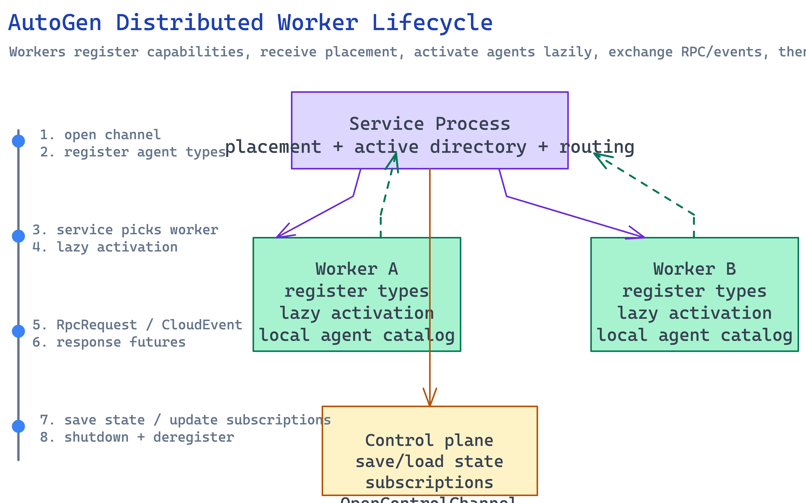

# Distributed Agent Worker Lifecycle

## Overview

This synthesis explains how AutoGen’s distributed runtime moves from abstract event-driven concepts to an actual worker/service lifecycle. It combines the design docs, the shared protobuf contracts, and the Python/.NET implementation surfaces into one lifecycle story.

[Edit source diagram](../assets/graphs/autogen-distributed-worker-lifecycle.excalidraw)

## Systems Involved

- [Distributed Runtime and Worker System](../entities/distributed-runtime-and-worker-system.md)
- [Protocol Contracts](../entities/protocol-contracts.md)
- [Python Extensions](../entities/python-extensions.md)
- [Dotnet Runtime Stack](../entities/dotnet-runtime-stack.md)

## Interaction Model

The lifecycle follows the phases in `docs/design/03 - Agent Worker Protocol.md`.

1. **Worker startup**
   A worker process starts and opens a bidirectional connection to a service. In Python this is the role of the gRPC worker runtime and its host connection.

2. **Capability advertisement**
   The worker registers the agent types it can host. This lets the service maintain a mapping from agent type/name to eligible workers.

3. **Idle placement readiness**
   At this point the worker may not yet be hosting any active agent instances. It is simply available for placement.

4. **Request-triggered activation**
   When a message arrives for an inactive agent, the service selects an eligible worker and routes the request there. The worker checks its local catalog, creates the agent instance if needed, and records it as active.

5. **Operational messaging**
   The worker handles two main classes of traffic:
   - event publication, typically using the CloudEvent path
   - RPC-style requests and responses, where request ids map to pending promises or futures

6. **Subscription and state management**
   The runtime may also manage subscriptions or process control-plane messages for saving/loading state.

7. **Shutdown**
   The worker closes the connection and exits. The service removes that worker and any hosted agents from its active directory.

## Key Interfaces

| Boundary | Contract |
|----------|----------|
| Worker <-> Service data channel | `AgentRpc.OpenChannel` in `agent_worker.proto` |
| Worker <-> Service control channel | `AgentRpc.OpenControlChannel` |
| Worker capability advertisement | `RegisterAgent` RPC |
| Event envelope | `CloudEvent` in `cloudevent.proto` |
| RPC transport | `RpcRequest` / `RpcResponse` |

## Source Evidence

- `autogen/docs/design/03 - Agent Worker Protocol.md` defines the three phases and placement model.
- `protos/agent_worker.proto` defines worker registration, subscriptions, control messages, and the bidirectional RPC service.
- `python/packages/autogen-ext/src/autogen_ext/runtimes/grpc/_worker_runtime.py` shows the worker-side runtime implementation in Python.
- `dotnet/src/Microsoft.AutoGen/RuntimeGateway.Grpc/` provides the corresponding service/gateway infrastructure on the .NET side.

## See Also

- [Distributed Runtime and Worker System](../entities/distributed-runtime-and-worker-system.md)
- [Protocol Contracts](../entities/protocol-contracts.md)
- [Event-Driven Agent Programming Model](../concepts/event-driven-agent-programming-model.md)
- [Local to Distributed Runtime Scaling](../concepts/local-to-distributed-runtime-scaling.md)
- [Protocol-Mediated Cross-Language Runtime](../concepts/protocol-mediated-cross-language-runtime.md)
- [Python and Dotnet Ecosystem Relationship](python-and-dotnet-ecosystem-relationship.md)
