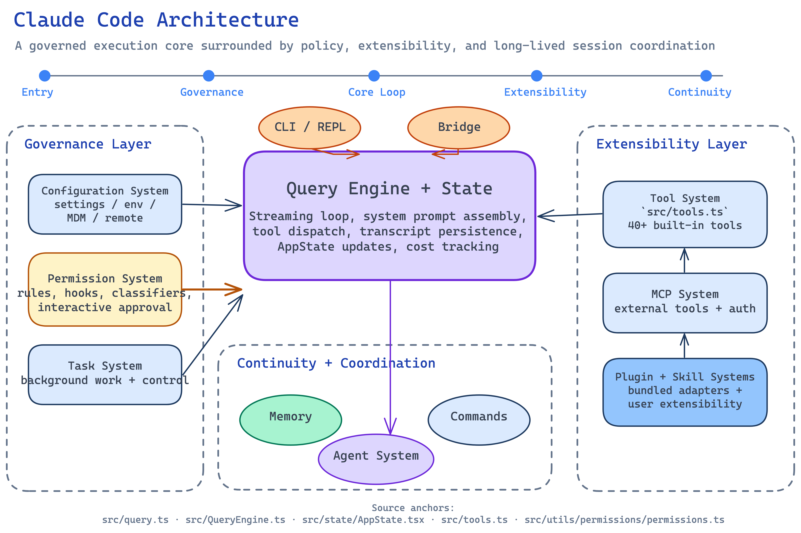

# Architecture Overview

## Overview

Claude Code is an AI-powered CLI tool built by Anthropic that provides an interactive terminal interface for working with Claude. It allows developers to use Claude directly from the command line for coding tasks such as editing files, running commands, searching codebases, managing git workflows, and more.

The application is built with **TypeScript** and uses **React** with **Ink** for terminal UI rendering. The entry point is `src/main.tsx`, which bootstraps the CLI via Commander.js, initializes configuration and authentication, loads tools and plugins, and launches the interactive REPL.

Claude Code is a substantial system with approximately 40+ built-in tools, a plugin architecture, MCP (Model Context Protocol) integration, multi-agent support, and a layered permission system. The codebase is designed to run on Bun and supports bundled distribution with dead-code elimination via `bun:bundle` feature flags.

[Edit source diagram](../assets/graphs/claude-code-architecture-map.excalidraw)

## Major Subsystems

### Query/Execution Engine

The core conversation loop lives in [`src/QueryEngine.ts`](../entities/query-engine.md) and [`src/query.ts`](../entities/query-engine.md). The QueryEngine orchestrates sending user messages to the Claude API, processing assistant responses, dispatching tool calls, injecting tool results back into the conversation, and looping until the model produces a final response. It manages abort controllers, file history snapshots, cost tracking, session storage, and transcript recording.

### Tool System

The [Tool System](../entities/tool-system.md) provides approximately 40 pluggable tools defined in `src/tools/`. Each tool (e.g., `BashTool`, `FileEditTool`, `GrepTool`, `AgentTool`, `WebSearchTool`) follows a common `Tool` interface defined in `src/Tool.ts`. Tools declare their input schemas, permission requirements, and execution logic. The system supports tool validation, progress reporting, and result formatting. Tools are registered via `src/tools.ts` and can be extended through MCP servers and plugins.

Key built-in tools include:
- **BashTool / PowerShellTool** -- shell command execution
- **FileReadTool / FileEditTool / FileWriteTool** -- file operations
- **GrepTool / GlobTool** -- code search
- **AgentTool** -- subagent spawning
- **SkillTool** -- skill invocation
- **MCPTool** -- MCP server tool proxying
- **TaskCreateTool / TaskGetTool / TaskUpdateTool** -- background task management
- **WebFetchTool / WebSearchTool** -- web access
- **NotebookEditTool** -- Jupyter notebook editing
- **TodoWriteTool** -- task tracking

### Agent System

The [Agent System](../entities/agent-system.md) enables spawning isolated subagents via `AgentTool` (in `src/tools/AgentTool/`). Agents run as nested query loops with their own conversation context and can be configured with custom system prompts and tool restrictions. The system supports named agent definitions loaded from an agents directory, color-coded agent identification, and coordinator/swarm modes for multi-agent collaboration.

### Skill System

The [Skill System](../entities/skill-system.md) (`src/skills/`) allows defining reusable, composable capabilities that can be invoked inline or forked into separate execution contexts. Skills are loaded from bundled definitions (`src/skills/bundled/`) or from user-configured skill directories. The `SkillTool` dispatches skill execution, and skills can also be triggered via slash commands.

### Permission System

The [Permission System](../entities/permission-system.md) implements layered permission gating for tool execution. It supports multiple permission modes (defined in `src/utils/permissions/PermissionMode.ts`) including interactive approval, auto-accept, and bypass modes. The system tracks permission denials, manages tool-specific allow lists parsed from CLI flags, and integrates with policy limits and enterprise managed settings. Permission checks occur before every tool invocation.

### MCP System

The [MCP System](../entities/mcp-system.md) (`src/services/mcp/`) provides Model Context Protocol integration, allowing Claude Code to connect to external MCP servers that expose additional tools, commands, and resources. Configuration is parsed from multiple sources (project, user, enterprise). The system handles server lifecycle management, tool/command/resource discovery, authentication (including XAA IDP), and official registry lookups.

### Task System

The [Task System](../entities/task-system.md) (`src/tasks/`) manages background task execution. It supports several task types including `LocalAgentTask`, `RemoteAgentTask`, `InProcessTeammateTask`, `LocalShellTask`, and `DreamTask`. Tasks can be created, monitored, updated, and stopped through dedicated tools (`TaskCreateTool`, `TaskGetTool`, `TaskListTool`, `TaskUpdateTool`, `TaskStopTool`, `TaskOutputTool`). The `Task.ts` type definition in `src/` establishes the shared task interface.

### State Management

[State Management](../entities/state-management.md) is centralized in `src/state/`. The `AppState` type (defined across `AppState.tsx` and `AppStateStore.ts`) holds the full application state including conversation messages, tool states, permission contexts, and UI state. A store (`store.ts`) provides state updates, and `onChangeAppState.ts` handles side effects triggered by state transitions. Selectors (`selectors.ts`) provide derived state access.

### Command System

The [Command System](../entities/command-system.md) (`src/commands/`) provides 100+ slash commands accessible from the REPL. Commands are registered in `src/commands.ts` and organized into subdirectories by domain (e.g., `mcp/`, `config/`, `agents/`, `bridge/`). Commands cover operations like `/commit`, `/compact`, `/cost`, `/diff`, `/doctor`, `/debug-tool-call`, and many more. Commands can also be contributed by MCP servers and plugins.

### Plugin System

The [Plugin System](../entities/plugin-system.md) (`src/plugins/`) provides extensibility through both bundled and external plugins. Plugin management utilities in `src/utils/plugins/` handle loading, caching, versioning, and orphan cleanup. Plugins can contribute tools, commands, and configuration. The system supports managed plugins (enterprise-controlled) and user-installed plugins with version pinning.

### Bridge System

The [Bridge System](../entities/bridge-system.md) (`src/bridge/`) enables CLI-to-web remote control, allowing a Claude Code terminal session to be controlled from a web interface. It implements a bidirectional messaging layer (`bridgeMessaging.ts`), session management (`sessionRunner.ts`, `createSession.ts`), permission callbacks (`bridgePermissionCallbacks.ts`), inbound message/attachment handling, and JWT-based authentication. The bridge can operate in both local and remote modes.

### Configuration System

The [Configuration System](../entities/configuration-system.md) provides layered settings resolution from multiple sources: CLI flags, environment variables, project-level config, user-level config, enterprise MDM (Mobile Device Management) settings (`src/utils/settings/mdm/`), and remote managed settings (`src/services/remoteManagedSettings/`). Settings are cached and validated, with change detection (`src/utils/settings/changeDetector.ts`) for runtime updates. The system supports migrations (`src/migrations/`) for evolving configuration formats.

### Memory System

The [Memory System](../entities/memory-system.md) provides persistent context through two mechanisms: **CLAUDE.md files** (project-level instructions loaded into the system prompt) and the **memdir** (`src/memdir/`) system for structured memory storage. Memory content is loaded at query time via `loadMemoryPrompt()` and injected into the system prompt to maintain continuity across sessions.

## Execution Model

A user query flows through the system as follows:

1. **Input**: The user types a message in the REPL (rendered via Ink/React components in `src/components/`). The input may also arrive via CLI arguments, piped stdin, or the Bridge system.

2. **User Input Processing**: The input is processed by `processUserInput()` which handles slash command detection, file attachment resolution, and message construction.

3. **System Prompt Assembly**: Before the API call, `fetchSystemPromptParts()` assembles the system prompt from multiple sources: base instructions, CLAUDE.md memory files, memdir content, tool descriptions, active skill context, and environment information.

4. **API Call**: The `query()` function in `src/query.ts` sends the assembled messages to the Claude API. The model, thinking configuration, and tool definitions are included in the request.

5. **Response Streaming**: The assistant response streams back. Text content is rendered incrementally in the terminal. If the response contains tool use blocks, execution continues.

6. **Tool Dispatch**: Each tool use block is matched to a registered tool via `toolMatchesName()`. The permission system gates execution. If approved, the tool runs and produces a result.

7. **Result Injection**: Tool results (success or error) are formatted as `tool_result` content blocks and appended to the conversation. Cost and usage are tracked.

8. **Loop**: If tool calls were made, the conversation (now including tool results) is sent back to the API for the next turn. This loop continues until the model produces a response with no tool calls, or the user interrupts.

9. **Transcript Recording**: The full conversation is persisted to session storage for resume capability and history.

## Technology Stack

| Layer | Technology |
|-------|-----------|
| Language | TypeScript |
| Runtime | Bun |
| Terminal UI | React + Ink |
| CLI Framework | Commander.js (`@commander-js/extra-typings`) |
| Schema Validation | Zod (v4) |
| AI API | Anthropic Claude API (`@anthropic-ai/sdk`) |
| Protocol | Model Context Protocol (`@modelcontextprotocol/sdk`) |
| Styling | Chalk (terminal colors) |
| Utilities | lodash-es |
| Build | Bun bundler with feature flags (`bun:bundle`) |

## See Also

- [Query Engine](../entities/query-engine.md)
- [Tool System](../entities/tool-system.md)
- [Agent System](../entities/agent-system.md)
- [Skill System](../entities/skill-system.md)
- [Permission System](../entities/permission-system.md)
- [MCP System](../entities/mcp-system.md)
- [Task System](../entities/task-system.md)
- [State Management](../entities/state-management.md)
- [Command System](../entities/command-system.md)
- [Plugin System](../entities/plugin-system.md)
- [Bridge System](../entities/bridge-system.md)
- [Configuration System](../entities/configuration-system.md)
- [Memory System](../entities/memory-system.md)
