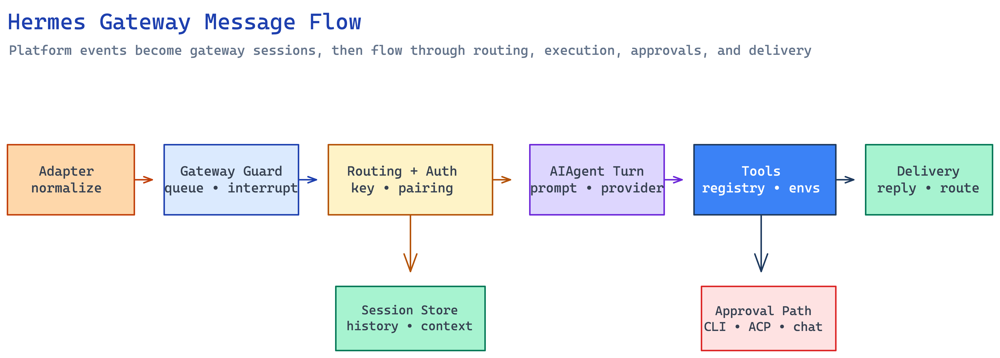

# Gateway Message to Agent Reply Flow

## Overview

This page traces one inbound platform event all the way to the final reply Hermes delivers back out. The simplest mental model is: if the session is idle, the message becomes a new agent turn; if the session is busy, Hermes either queues the message, interrupts the turn, or lets a control command bypass the normal path.

[Edit diagram source](../assets/graphs/hermes-gateway-message-flow.excalidraw)

## Systems Involved

The adapter edge normalizes inbound events, the gateway shell decides what they mean, session storage restores the transcript behind the turn, and the agent loop performs the actual work. Approval and delivery sit on the edges of that path rather than in its center, so keep [Messaging Platform Adapters](../entities/messaging-platform-adapters.md), [Gateway Runtime](../entities/gateway-runtime.md), [Session Storage](../entities/session-storage.md), [Agent Loop Runtime](../entities/agent-loop-runtime.md), [Tool Registry and Dispatch](../entities/tool-registry-and-dispatch.md), and [Interruption and Human Approval Flow](../concepts/interruption-and-human-approval-flow.md) nearby as you read.

## Interaction Model

The normal path is easiest to understand first.

1. A platform adapter receives the raw event.
   Telegram updates, Discord messages, Slack events, webhook payloads, and similar transport-specific inputs first land in the adapter layer. The adapter turns platform-native data into Hermes' normalized message shape, so the rest of the stack never has to reason about transport quirks directly.

2. The adapter normalizes the event and builds session source context.
   The normalized event carries a `SessionSource`, message text, media references, reply context, and the platform metadata Hermes needs later.

3. The gateway computes the live session key.
   `build_session_key(...)` and the surrounding session helpers turn the normalized source into a deterministic routing key. That key answers a narrow question: which live conversation lane should this event join?

4. The gateway checks authorization and pairing.
   The sender is evaluated against trusted surfaces, allow-all flags, pairing state, and allowlists before the turn is allowed to proceed. Pairing is the onboarding path for unknown direct-message users; it is not the same thing as session continuity.

5. If the session is idle, the gateway restores or creates session state and builds the agent.
   It assembles shell-specific context, restores conversation history when needed, and instantiates `AIAgent` with callbacks and session metadata.

6. The agent loop performs the turn.
   `AIAgent.run_conversation()` owns the model/tool loop. It may call tools, request approval for dangerous operations, emit progress, or trigger fallback and compression behavior.

7. The gateway delivers the reply.
   The final assistant output is routed back through the originating adapter or through an explicit delivery target. Delivery policy stays in the gateway layer; the adapter owns the actual send operation.

That happy path is only half the story. When the session is already busy, the gateway does not start a duplicate turn. It branches before agent construction:

1. A normal follow-up message is queued or used to interrupt the running turn.
   Hermes treats busy-session input as ordered control flow, not as an error. The adapter and gateway both guard the session, so a late-arriving message can be held for the next turn or marked as an interrupt.

2. `/queue` is the explicit "next turn" path.
   It appends work for later without interrupting the current agent turn. This is different from bypass commands, which are controls rather than queued user text.

3. Control commands bypass the busy-session path entirely.
   `/status`, `/stop`, `/new`, `/reset`, `/approve`, and `/deny` are handled as shell controls. They must reach the runner or approval handler directly, because queuing them would either deadlock or replay control text as ordinary prompt content.

The important boundary changes are:

- adapter -> gateway when raw transport data becomes a normalized Hermes event
- gateway -> agent loop when a message becomes an `AIAgent` turn
- agent loop -> tool runtime when the model emits tool calls
- tool runtime -> gateway or approval transport when a human decision is required
- gateway -> adapter again when the final reply is delivered

## Key Interfaces

| Boundary | What crosses it | Why it matters |
| --- | --- | --- |
| Adapter -> gateway | Normalized `MessageEvent` plus `SessionSource` | This replaces platform-specific payloads with one shared event contract. |
| Gateway -> session storage | Session key, reset policy, transcript restore request | The gateway chooses the live lane; storage supplies the durable history behind it. |
| Gateway -> agent loop | Restored conversation history, shell callbacks, session context | The turn becomes an `AIAgent` execution instead of gateway policy. |
| Agent loop -> tool runtime | Tool calls, approval requests, callback events | Model intent becomes side effects or a blocked approval path. |
| Gateway -> delivery layer | Reply text plus target selection | The gateway chooses where the reply should go; the adapter performs the send. |

## Busy-Session Branches

Hermes keeps busy sessions readable by making the branch decision explicit instead of hiding it inside generic retry logic.

### Decision path

When a new event arrives for an existing session, Hermes follows this order:

1. If the event is `/status`, report progress and leave the running turn alone.
2. If the event is `/stop`, force-clear the session so the user can recover immediately.
3. If the event is `/new` or `/reset`, interrupt the run and reset the session instead of replaying the control text later.
4. If the event is `/approve` or `/deny`, route it to the approval handler because the blocked tool call is waiting on human input.
5. If the event is `/queue`, store it as the next turn without interrupting the current one.
6. Otherwise, treat the event as normal busy-session input and either interrupt the active turn or hold it for the next turn, depending on the adapter and gateway guard state.

### Why the split matters

Queued messages preserve order under interruption. Control commands are different: they are shell operations that must preempt the normal message-to-agent flow, not sit behind it.

## Agent Construction And Tool Interaction

Once the gateway decides the event is an ordinary turn, it prepares the runtime state that `AIAgent` needs:

- session history is restored or created through the gateway session layer
- source metadata is packaged into the session context prompt
- gateway callbacks are attached for progress, status, and delivery hooks
- the agent is started with the current message as the new turn

After that handoff, the loop owns the conversation. If the model emits tool calls, `AIAgent` handles them inside the [Agent Loop Runtime](../entities/agent-loop-runtime.md) and the [Tool Registry and Dispatch](../entities/tool-registry-and-dispatch.md) path. If a tool needs approval, the decision is transported back out through the shell that is hosting the conversation.

## Final Delivery

Delivery is the last ownership boundary. The gateway decides the destination, and `gateway/delivery.py` turns that destination into a concrete platform send. Hermes does not always answer where the input arrived, so cron jobs, background tasks, and cross-platform routing all need reply policy separate from transport mechanics.

## Source Evidence

The page is anchored in these implementation files and docs:

- `hermes-agent/gateway/run.py` for `_handle_message()`, running-session guards, slash-command branching, agent construction, queued-message handling, approval bypasses, and delivery handoff
- `hermes-agent/gateway/session.py` for `SessionSource`, `build_session_key()`, and the session-context helpers used during routing
- `hermes-agent/gateway/delivery.py` for destination resolution and final outbound send policy
- `hermes-agent/gateway/platforms/` for inbound normalization and adapter-local send behavior
- `hermes-agent/website/docs/developer-guide/gateway-internals.md` for the maintainer-facing description of the same control flow

## See Also

- [Gateway Runtime](../entities/gateway-runtime.md)
- [Messaging Platform Adapters](../entities/messaging-platform-adapters.md)
- [Session Storage](../entities/session-storage.md)
- [Agent Loop Runtime](../entities/agent-loop-runtime.md)
- [Tool Call Execution and Approval Pipeline](tool-call-execution-and-approval-pipeline.md)
- [Interruption and Human Approval Flow](../concepts/interruption-and-human-approval-flow.md)
- [Multi-Surface Session Continuity](../concepts/multi-surface-session-continuity.md)
