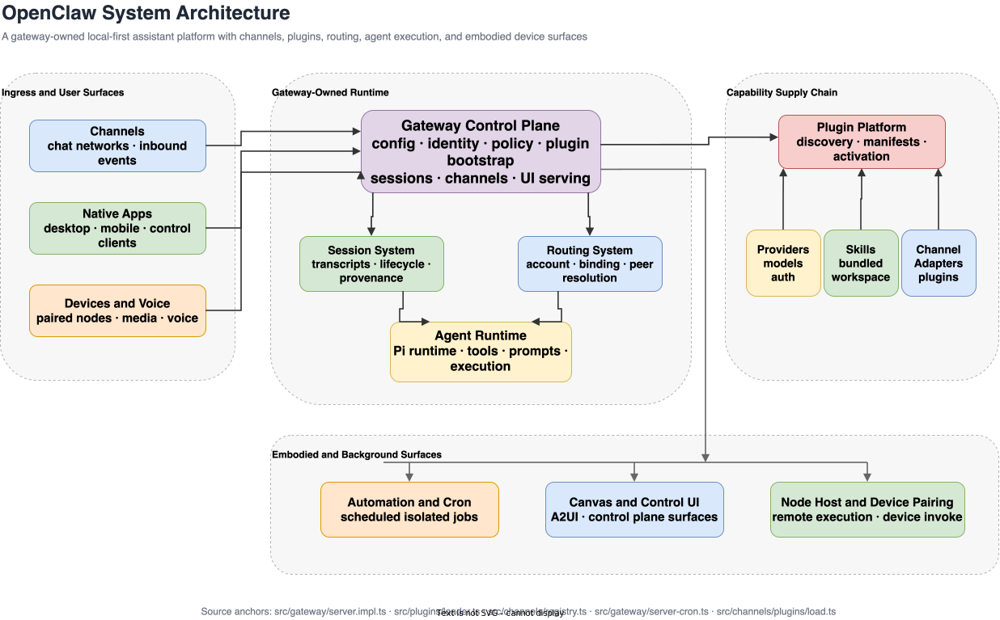

# Architecture Overview

## Overview

[OpenClaw](../entities/gateway-control-plane.md) is a large TypeScript monorepo for a personal AI assistant that runs on the user's own devices. The core product is not a single chat window but a local-first system composed of a gateway control plane, a configurable [Agent Runtime](../entities/agent-runtime.md), multi-channel [Channel System](../entities/channel-system.md), a large [Plugin Platform](../entities/plugin-platform.md), background [Automation and Cron](../entities/automation-and-cron.md), and companion app/device surfaces documented in [Native Apps and Platform Clients](../entities/native-apps-and-platform-clients.md).

OpenClaw is a platform-shaped repository whose gateway is the operational center of gravity. The assistant can speak through many channels, expose device surfaces, run scheduled jobs, host a control UI, attach protocol bridges, and activate a large extension ecosystem, but those capabilities are coordinated through one local-first gateway runtime. The gateway owns the configuration, identity, policy, channel registry, plugin activation, and session lifecycle that make the rest of the system coherent.
That design means the repo cannot be understood only as an LLM wrapper. The agent runtime is embedded inside a wider control plane that manages channel ingress, route resolution, app and device pairing, plugin capabilities, scheduled jobs, media and voice tooling, and multiple native clients. Understanding OpenClaw therefore requires following how policy and identity propagate through the gateway into the rest of the platform.

[Edit source diagram](../assets/graphs/openclaw-system-architecture.drawio)

## Major Subsystems

| Subsystem | Why It Matters |
| --- | --- |
| [Gateway Control Plane](../entities/gateway-control-plane.md) | Gateway server startup, auth, sessions, plugin bootstrap, and control-plane duties |
| [CLI and Onboarding](../entities/cli-and-onboarding.md) | CLI entry points, onboarding, doctor, daemon, and update flows |
| [Agent Runtime](../entities/agent-runtime.md) | Pi/agent execution, tools, prompts, embedded runners, and sandbox edges |
| [Session System](../entities/session-system.md) | Session identity, lifecycle, provenance, send policy, and transcript events |
| [Channel System](../entities/channel-system.md) | Channel abstractions, gating, typing, metadata, and reply-facing conventions |
| [Channel Plugin Adapters](../entities/channel-plugin-adapters.md) | Plugin-backed channel integrations, bindings, pairing, setup, and approvals |
| [Plugin Platform](../entities/plugin-platform.md) | Loader, manifests, install/uninstall, registry state, and runtime activation |
| [Provider and Model System](../entities/provider-and-model-system.md) | Provider catalogs, auth choices, model selection, and failover surfaces |
| [Routing System](../entities/routing-system.md) | Account, peer, and binding-based route resolution into agent/session targets |
| [Automation and Cron](../entities/automation-and-cron.md) | Scheduled jobs, isolated-agent execution, delivery, and timer service |
| [Canvas and Control UI](../entities/canvas-and-control-ui.md) | Canvas host, A2UI, and web/control-plane presentation surfaces |
| [Node Host and Device Pairing](../entities/node-host-and-device-pairing.md) | Remote device execution, pairing, invocation, and capability policies |

## Execution Model

The repository should be read as one architecture with several surfaces rather than a loose collection of packages. OpenClaw keeps its center of gravity in the runtime modules that decide state, policy, and execution, then layers user-facing shells or protocol adapters on top of that shared core.

1. The gateway boots configuration, auth, plugins, channels, session services, cron, device and node registries, protocol bridges, and UI assets into one long-lived control-plane process.
2. Inbound activity is normalized by channels and channel adapters, then routed into specific agent and session lanes where the agent runtime, provider stack, and send policy can act safely.
3. Plugins, provider packages, skills, canvas surfaces, device hosts, and voice and media services extend that same gateway-owned runtime rather than bypassing it.
4. Apps and paired devices therefore feel like product peers, but they still depend on the same local gateway for identity, policy, and state.

## Architectural Themes

| Theme | What It Explains |
| --- | --- |
| [Local First Personal Assistant Architecture](../concepts/local-first-personal-assistant-architecture.md) | The assistant is intended to run under user control on local devices. |
| [Gateway As Control Plane](../concepts/gateway-as-control-plane.md) | The gateway owns the system-wide contracts for channels, sessions, tools, and UI surfaces. |
| [Multi Channel Session Routing](../concepts/multi-channel-session-routing.md) | Channel and account context is normalized into isolated lanes. |
| [Pluginized Capability Delivery](../concepts/pluginized-capability-delivery.md) | Providers, tools, channels, and skills arrive through plugin activation. |
| [Device Augmented Agent Architecture](../concepts/device-augmented-agent-architecture.md) | Nodes, apps, canvas, and voice extend the assistant into the physical device ecosystem. |

## Entry Points For Newcomers

Start with [Gateway Control Plane](../entities/gateway-control-plane.md), [Plugin Platform](../entities/plugin-platform.md), [Channel System](../entities/channel-system.md), [Routing System](../entities/routing-system.md), and [Inbound Message To Agent Reply Flow](../syntheses/inbound-message-to-agent-reply-flow.md).

The most useful reading order is usually summary, then hub entity, then synthesis. That sequence lets a newcomer first understand the system boundary, then inspect the runtime owner for a given concern, then see how that concern composes with its neighboring systems.

## See Also

- [Codebase Map](codebase-map.md)
- [Gateway Control Plane](../entities/gateway-control-plane.md)
- [Plugin Platform](../entities/plugin-platform.md)
- [Inbound Message to Agent Reply Flow](../syntheses/inbound-message-to-agent-reply-flow.md)
- [Gateway As Control Plane](../concepts/gateway-as-control-plane.md)
- [Glossary](glossary.md)
